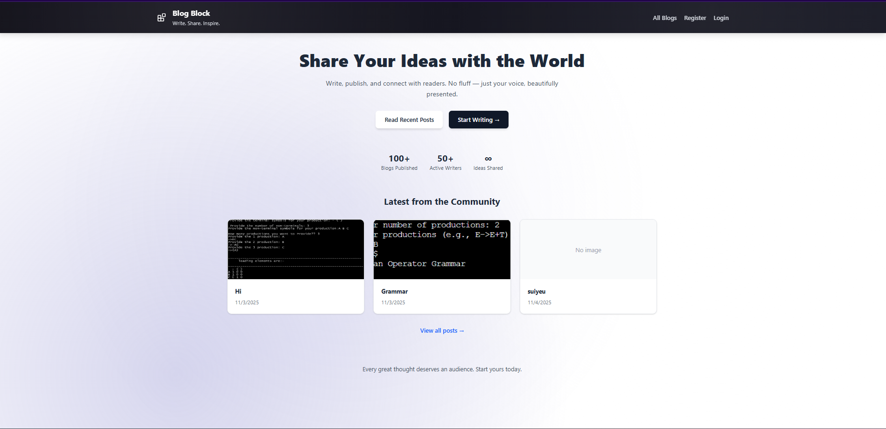
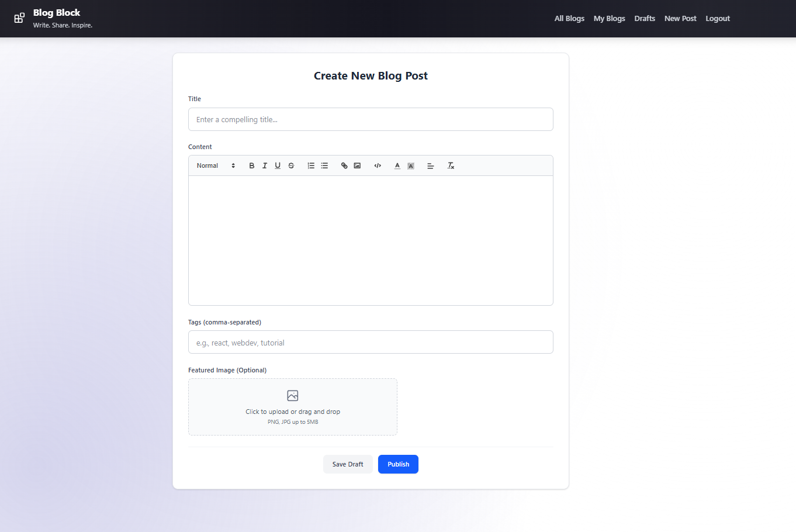

# Blog-app

This repository contains a full-stack blogging application with a TypeScript/Node.js backend and a React + Vite frontend. It supports user authentication (JWT), rich-text blog authoring (React Quill), image uploads, draft auto-save and basic blog management (CRUD).

## Quick summary

- Backend: Express + TypeScript, MongoDB (Mongoose), JWT auth, file uploads (multer).
- Frontend: React + Vite + TypeScript, Tailwind CSS, React Quill rich text editor, Axios for API calls.

This README documents how to run the project locally, required environment variables, API endpoints and useful developer notes.

## Table of contents

- Features
- Repo layout
- Requirements
- Environment variables
- Run (development & production)
- API reference
- Uploads & auth notes
- Contributing
- Troubleshooting & next steps

## Features

- User registration and login (JWT)
- Protected API routes for authenticated users
- Create / edit / publish / delete blog posts
- Drafts with auto-save (every 30s + on stop-typing)
- Rich-text editor "React Quill" with image support
- Tags and per-user blog filtering


## 🧩 Rich Text Editing with React Quill

The blog editor uses **React Quill** with a customized toolbar and Tailwind-integrated styling.

### Toolbar Includes:
- Headers (H1, H2, H3)
- Bold, italic, underline, and strike-through  
- Ordered and unordered lists  
- Links and image insertion  
- Code blocks for syntax highlighting  
- Text color and background customization  
- Alignment options  
- Clear formatting  

## Repository layout (important files)

Top-level folders:

- `backend/` - Express API (TypeScript)

  - `server.ts` - app entry
  - `routes/` - `authRoutes.ts`, `blogRoutes.ts`
  - `models/` - `User.ts`, `Blog.ts`
  - `middleware/` - `authMiddleware.ts`, `upload.ts`
  - `uploads/` - served static files (uploaded images)

- `frontend/` - React + Vite app (TypeScript)
  - `src/` - React code
  - `src/components/` - Editor, BlogList, PostDetail, Register, Login, etc.
  - `src/context/AuthContext.tsx` - auth state
  - Uses `import.meta.env.VITE_API_URL` to build image URLs / API base in code


## Project Structure
blog-block/
├── backend/
│   ├── models/
│   │   ├── User.ts
│   │   └── Blog.ts
│   ├── routes/
│   │   ├── authRoutes.ts
│   │   └── blogRoutes.ts
│   ├── controllers/
│   │   ├── authController.ts
│   │   └── blogController.ts
│   ├── middleware/
│   │   └── authMiddleware.ts
│   ├── server.ts
│   └── .env
└── frontend/
    ├── src/
    │   ├── components/
    │   │   ├── Navbar.tsx   ← Animated "Blocks" icon with Framer Motion  
    │   │   ├── Blocks.tsx   ← Motion-based animated logo  
    │   │   ├── BlogEditor.tsx  
    │   │   ├── BlogList.tsx  
    │   │   ├── Login.tsx  
    │   │   └── Register.tsx  
    │   ├── context/
    │   │   └── AuthContext.tsx
    │   ├── utils/
    │   │   └── axios.ts
    │   ├── App.tsx
    │   └── main.tsx
    └── .env


## Requirements

- Node.js (v16+ recommended)
- npm or yarn
- MongoDB (local or Atlas)

## Environment variables

Create a `.env` file inside `backend/` and `frontend/` (frontend may use Vite env vars). Example values follow.

Backend (`backend/.env`):

PORT=5000
MONGODB_URI=mongodb://localhost:27017/blogging
JWT_SECRET=your_jwt_secret_here
NODE_ENV=development
FRONTEND_URL=http://localhost:5173

Frontend (`frontend/.env`)

REACT_APP_API_URL=http://localhost:5000
VITE_API_URL=http://localhost:5000

Notes:

- `JWT_SECRET` must be set to a secure random string in production.
- `FRONTEND_URL` is used in CORS configuration.

Frontend (`frontend/.env` for Vite):

VITE_API_URL=http://localhost:5000

Note: some older READMEs use `REACT_APP_API_URL`; this project uses Vite (`VITE_*`) in source code (see `import.meta.env.VITE_API_URL`).

## Scripts & how to run (Windows - cmd.exe)

Open two terminals (one for backend, one for frontend).

Backend (development):

```cmd
cd backend
npm install
npm run dev
```

Backend (production build):

```cmd
cd backend
npm install
npm run build
npm start
```

Frontend (development):

```cmd
cd frontend
npm install
npm run dev
```

Frontend (production build + preview):

```cmd
cd frontend
npm install
npm run build
npm run preview
```

Notes:

- Backend dev script uses `ts-node-dev` and runs `server.ts` directly.
- The backend serves uploaded images from `backend/uploads` at the `/uploads` route.

## API reference (important endpoints)

Base URL (development): http://localhost:5000

Authentication

- POST /api/auth/register

  - Body: { username, password }
  - Response: { token }

- POST /api/auth/login

  - Body: { username, password }
  - Response: { token, message }
  - Behavior: On login the server sets an HTTP-only cookie `token` (if cookie support enabled) and also returns the token in JSON. The backend accepts the JWT either from that cookie or the `x-auth-token` header.

- GET /api/auth/me
  - Protected. Returns the current user's public data (no password).

Blogs

- GET /api/blogs

  - Optional query params: `status` (draft|published), `user` (user id)
  - Returns an array of blog objects. Published posts are shown publicly.

- GET /api/blogs/:id

  - Returns a single blog post.

- POST /api/blogs

  - Protected (authenticated user required)
  - Body: { title, content, tags[], status (draft|published), imageUrl }
  - Creates a blog linked to the authenticated user. Returns created blog.

- PATCH /api/blogs/:id

  - Protected (only owner allowed)
  - Body: partial fields to update. Returns updated blog.

- DELETE /api/blogs/:id
  - Protected (only owner allowed)
  - Deletes the blog.

Image upload (used by editor)

- POST /api/blogs/upload-image
  - Protected
  - Expects `multipart/form-data` with a field named `image`.
  - Returns: { imageUrl: string } where `imageUrl` is the path to be prefixed with `VITE_API_URL` in the frontend (e.g. `/uploads/<filename>`).

Authentication details

- The backend verifies JWTs using the value in `process.env.JWT_SECRET`.
- `authMiddleware` looks for the token in `req.cookies.token` first, then `x-auth-token` header.

Security note about passwords

- The project uses `bcryptjs` and `UserSchema.methods.matchPassword` for comparing passwords.
- There is a commented-out `pre('save')` hook for hashing the password in `backend/models/User.ts`. Ensure that passwords are hashed before saving to the database (uncomment or add a hashing step) before deploying to production.

## Uploads

- Uploaded files are stored under `backend/uploads` and served statically at `http://<host>:<port>/uploads/<filename>`.
- The frontend displays images by concatenating `import.meta.env.VITE_API_URL` with the returned `imageUrl` (for example: `${VITE_API_URL}${imageUrl}`).

## Developer notes & gotchas

- Backend TypeScript config: build outputs to `dist/` (run `npm run build` in `backend/`).
- The backend has retry logic for MongoDB connection — it retries on connect failure.
- CORS is preconfigured to allow `FRONTEND_URL` with credentials (cookies) enabled. When testing with the frontend running on a different port, set `FRONTEND_URL` accordingly.
- The front end stores a token in localStorage and uses `axios` instances that call `/api/auth/me` to verify token and load user state.

## Contributing

1. Fork the repository
2. Create a feature branch: `git checkout -b feature/awesome`
3. Commit: `git commit -m "Add awesome feature"`
4. Push and open a Pull Request

Please include tests for new backend logic where appropriate and lint the frontend using the provided ESLint config.

## Troubleshooting

- If the frontend cannot reach the API, check `VITE_API_URL` in `frontend/.env` and `FRONTEND_URL` in `backend/.env`.
- If MongoDB connection fails, ensure `MONGODB_URI` is correct and the DB is reachable. The backend retries the connection but check logs for authentication errors.
- If login fails with token errors, confirm `JWT_SECRET` matches between environment and any tokens issued earlier.





